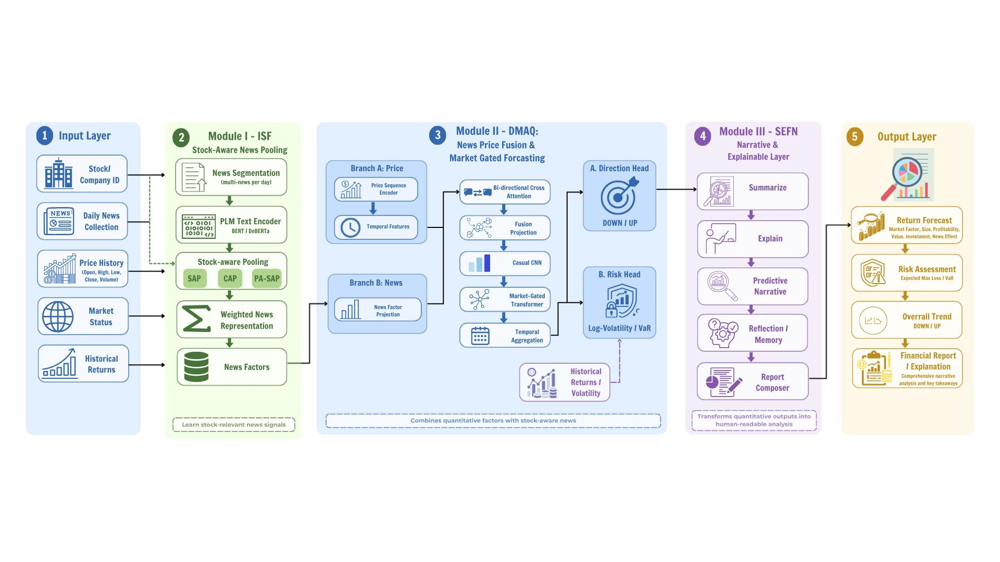

# SAFIR Framework

SAFIR là framework dự báo xu hướng cổ phiếu và sinh báo cáo rủi ro dựa trên ba nguồn tín hiệu chính: tin tức, chuỗi giá và trạng thái thị trường, trong đó pipeline được chia thành ba module:

1. **Module I - ISF / Stock-aware News Pooling**: mã hóa tin tức bằng BERT và gom nhiều bản tin trong ngày thành một vector tin tức có điều kiện theo mã cổ phiếu.
2. **Module II - DMAQ / News-Price Fusion**: hợp nhất vector tin tức với chuỗi giá, trạng thái thị trường và risk head để dự báo chiều biến động.
3. **Module III - SEP-style Report Generation**: tạo báo cáo PDF một trang từ kết quả inference, độ tin cậy, VaR và các nhân tố giải thích.



Mặc định bài toán được cấu hình là phân loại nhị phân `DOWN` / `UP` vì dữ liệu hiện tại dùng nhãn `{0, 1}`. Chế độ tam phân vẫn được hỗ trợ qua `--label-mode ternary`, nhưng chỉ nên dùng khi nhãn đã được xây dựng lại theo quy tắc phù hợp.

## Cấu trúc thư mục

```text
SAFIR_FRAMEWORK/
  main.py                         # Entry point train/eval
  run_inference.py                # Inference + sinh CSV/PDF report
  src/
    config.py                     # Cấu hình trung tâm
    data_preprocessing.py         # Làm sạch dữ liệu, tokenizer, scaler, dataloader
    model_isf.py                  # Module I: stock-aware news pooling
    model_dmaq.py                 # Module II: news-price fusion + risk head
    model_main.py                 # Ghép ISF + DMAQ + optional SEFN
    trainer.py                    # Training loop, metrics, early stopping
    sep_report.py                 # Sinh báo cáo PDF
    evaluate_*.py                 # Script đánh giá module, ablation, paper-style table
  baselines/                      # Baseline theo từng module
  artifacts/preprocessing_v3/     # scaler, code vocabulary, metadata sau train
  outputs/                        # Kết quả đánh giá, bảng, report mẫu
  notebooks/                      # Notebook thử nghiệm dữ liệu/module
```

## Luồng xử lý chính

### 1. Tiền xử lý dữ liệu

`src/data_preprocessing.py` đọc ba split `train.csv`, `val.csv`, `test.csv` từ thư mục dữ liệu. Dữ liệu đầu vào cần có tối thiểu:

| Nhóm cột | Cột |
|---|---|
| Định danh | `CODE`, `DATE` hoặc `trade_date` |
| Tin tức | `text_a` hoặc `TITLE` |
| Giá | `open1`...`open5`, `close1`...`close5` |
| Nhãn | `label` |

Pipeline sẽ:

- bỏ các cột kỹ thuật cũ như `Unnamed: 0`, `READ`, `DESCRIPTION`;
- chuẩn hóa ngày giao dịch;
- tự tạo `text_a` từ `TITLE` nếu thiếu;
- tính trạng thái thị trường theo ngày gồm `mkt_mean` và `mkt_std`;
- tạo `CODE -> code_id` vocabulary, trong đó `0` là `UNK`;
- pad/truncate cửa sổ giá về `lookback=20`;
- chuẩn hóa giá bằng `StandardScaler`;
- tokenize tối đa `max_news_per_day` bản tin, mỗi bản tin dài tối đa `max_text_len`.

Các asset tiền xử lý được lưu vào `artifacts/preprocessing_v3/` để dùng lại khi inference.

### 2. Module I: Stock-aware News Pooling

`src/model_isf.py` dùng `bert-base-chinese` mặc định để lấy embedding `[CLS]` cho từng bản tin. Các layer BERT đầu được freeze để giảm chi phí huấn luyện. Sau đó `StockAwareNewsPooling` gom các bản tin trong ngày thành một `news_factor`.

Repo hỗ trợ ba kiểu pooling:

| Mode | Ý tưởng |
|---|---|
| `cap` | Stock embedding làm query, news embedding làm key/value |
| `sap` | Stock token được nối vào chuỗi news rồi attention |
| `pa_sap` | News embedding được cộng thêm stock embedding và position embedding |

### 3. Module II: News-Price Fusion

`src/model_dmaq.py` nhận `price_seq`, `news_factor`, `mkt_vector` và `code_ids`. Logic chính gồm:

- project chuỗi giá và news factor về cùng chiều `d_model`;
- cross-attention hai chiều giữa giá và tin tức;
- causal convolution để tránh dùng thông tin tương lai;
- market-guided gating theo `mkt_mean`, `mkt_std`;
- Transformer block có gate thị trường;
- temporal attention để tổng hợp chuỗi thời gian;
- optional relation GCN nếu có ma trận quan hệ cổ phiếu;
- return head cho nhãn `DOWN` / `UP`;
- risk head dự báo `log_vol` và `var_est`.

Loss huấn luyện là:

```text
total_loss = cross_entropy_loss + risk_loss
```

Trong đó `risk_loss` dùng Smooth L1 cho mục tiêu volatility và VaR, với trọng số cấu hình trong `src/config.py`.

### 4. Module III: Sinh báo cáo

`run_inference.py` gọi `src/sep_report.py` để tạo báo cáo PDF bằng `reportlab`. Báo cáo gồm:

- mã cổ phiếu và ngày giao dịch;
- tin tức đầu vào;
- dự báo chiều biến động;
- confidence và xác suất từng lớp;
- VaR estimate;
- khoảng lợi suất ước lượng;
- các factor giải thích được rút ra từ representation của mô hình.

Có thể tắt sinh PDF bằng `--no-report` và chỉ lưu `inference_summary.csv`.

## Cài đặt

```bash
python -m venv .venv
.venv\Scripts\activate
pip install -r requirements.txt
```

Nếu chạy trên CPU hoặc môi trường không hỗ trợ `torch-geometric`, có thể cần cài PyTorch/PyG theo đúng CUDA version của máy trước khi chạy `pip install -r requirements.txt`.

## Train

Ví dụ train cấu hình mặc định v3:

```bash
python main.py ^
  --data-path datasets/raw ^
  --epochs 20 ^
  --label-mode binary ^
  --news-pooling sap ^
  --max-news-per-day 4 ^
  --checkpoint-path checkpoint_v3.pt ^
  --best-model-path finreport_nextgen_v3_best.pt ^
  --asset-dir artifacts/preprocessing_v3
```

Các tuỳ chọn quan trọng:

| Tham số | Ý nghĩa |
|---|---|
| `--label-mode binary/ternary` | Chọn chế độ nhãn |
| `--news-pooling cap/sap/pa_sap` | Chọn cơ chế stock-aware pooling |
| `--max-news-per-day` | Số bản tin tối đa mỗi ngày |
| `--no-class-weights` | Tắt class weights cho dữ liệu lệch lớp |
| `--no-bidirectional-fusion` | Tắt cross-attention hai chiều |
| `--es-metric` | Metric early stopping, mặc định `val_f1_macro` |
| `--eval-only` | Chỉ load checkpoint và đánh giá test set |

## Inference và sinh báo cáo

Chạy inference cho một mã cổ phiếu:

```bash
python run_inference.py ^
  --data data_raw.csv ^
  --model finreport_nextgen_v3_best.pt ^
  --asset-dir artifacts/preprocessing_v3 ^
  --code 600790 ^
  --output outputs/reports ^
  --save-csv
```

Một số chế độ chọn mẫu:

| Tham số | Ý nghĩa |
|---|---|
| `--code` | Lọc theo mã cổ phiếu |
| `--date YYYY-MM-DD` | Lọc theo ngày |
| `--full` | Chạy toàn bộ dữ liệu sau khi lọc |
| `--batch --top-n N` | Chạy N dòng mới nhất |
| `--lang en/zh/both` | Ngôn ngữ PDF |
| `--no-report` | Không sinh PDF, chỉ lưu CSV |

## Đánh giá và bảng paper-style

Repo có các script đánh giá trong `src/`:

| Script | Mục đích |
|---|---|
| `evaluate_modules.py` | Đánh giá output trung gian và zero-ablation theo news/price/market |
| `evaluate_ablation_table.py` | Tạo bảng ablation kiểu paper |
| `evaluate_finreport_v3_real_tables.py` | Tạo bảng GRS, VaR và backtest kiểu paper |
| `train_stagewise_modules.py` | Huấn luyện/đánh giá theo từng stage module |

Ví dụ tạo bảng paper-style:

```bash
python src/evaluate_finreport_v3_real_tables.py ^
  --data-path datasets/raw ^
  --full-model module_stage_outputs/checkpoints/full_news_factors_best.pt ^
  --factors-model module_stage_outputs/checkpoints/dmaq_factors_best.pt ^
  --split test ^
  --label-mode binary ^
  --news-pooling sap ^
  --max-news-per-day 4 ^
  --output-dir outputs/eval_results
```

## Kết quả thực nghiệm

Các bảng dưới đây được lấy từ `outputs/eval_results/finreport_v3_paper_style_real_eval.md` và các CSV tương ứng.

### Return Forecasting / Explanatory Power

| Model | GRS | GRS p-value | Mean Absolute Value of Alpha | Mean R^2 | T | N assets |
|---|---:|---:|---:|---:|---:|---:|
| Ours-Factors | 0.886418 | 0.495050 | 0.002763 | 0.492783 | 76 | 5 |
| Ours-News+Factors | 0.353384 | 0.878384 | 0.001371 | 0.484653 | 76 | 5 |

### VaR Risk Assessment

| Model | RMSE | MAE | VaR Loss | Coverage Rate |
|---|---:|---:|---:|---:|
| Ours-Factors | 0.033920 | 0.028427 | 0.000529 | 0.974272 |
| Ours-News+Factors | 0.640732 | 0.638848 | 0.000000 | 1.000000 |

### Backtest in Real-world Scenario Style

| Model | Maximum Drawdown | Annualized Rate of Return | Sharpe Ratio | Cumulative Return | Win Rate | Trading Days |
|---|---:|---:|---:|---:|---:|---:|
| Ours-Factors | -0.580925 | -0.080104 | 0.037511 | -0.173191 | 0.470383 | 574 |
| Ours-News+Factors | -0.667871 | -0.168877 | -0.140319 | -0.343831 | 0.473868 | 574 |

## Ghi chú tái lập

- `main.py` luôn lưu scaler, vocabulary và metadata vào `--asset-dir`; inference cần đúng các asset này.
- `run_inference.py` có thể tự load cấu hình từ `preprocessing_meta.joblib`, nhưng tham số CLI vẫn có thể override.
- Nếu checkpoint có cấu hình khác với CLI, cần giữ thống nhất `label_mode`, `news_pooling`, `max_news_per_day`, `lookback` và `bert_model`.
- PPO trong SEFN đang được tắt mặc định vì chưa có dữ liệu giải thích thật và reward model riêng.
- Các bảng paper-style hiện là đánh giá theo factor học được từ checkpoint, không phải FF5 chuẩn nếu chưa cung cấp factor FF5 thật.
